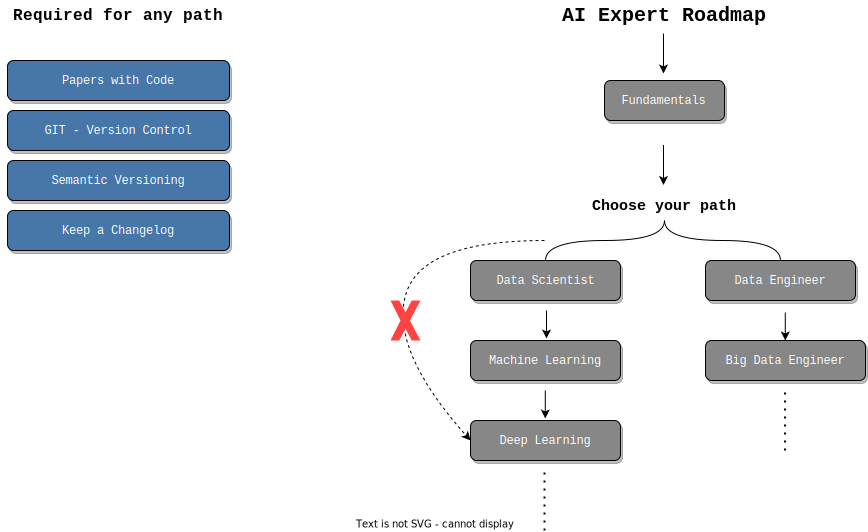
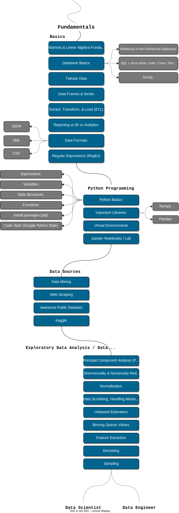
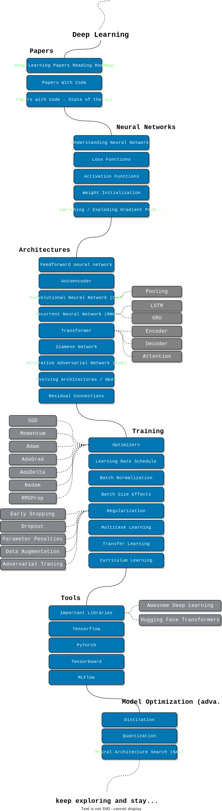

# AI

These are the source files for a light weight implementation of machine learning algorithms.

The idea is to learn machine learning by implementing the algorithms from ground up, harnessing the capabilities of plain numpy. This initiative goes beyond utilizing existing tools; it is a meticulous crafting of custom implementations that dive deep into the intricate mathematics underpinning each algorithm.

To contribute to AI, please read the [style guide](https://www.tensorflow.org/community/contribute/docs_style).

To jump onto the **Artificial Intelligence** roadmap, please click on the
[Artificial Intelligence Map](https://github.com/joshiayush/ai#roadmap).

## Contents

Check out [joshiayush.github.io/ai](https://joshiayush.github.io/ai) to learn about machine learning and various machine learning algorithms.

## API Usage

Using the `LinearRegression` estimator:

```python
import numpy as np

from sklearn import datasets
from sklearn.metrics import accuracy_score
from sklearn.model_selection import train_test_split

from ai.linear_model import LinearRegression

X, y = datasets.make_regression(n_samples=100, n_features=1, noise=20, random_state=4)
X_train, X_test, y_train, y_test = train_test_split(
    X, y, test_size=0.2, random_state=42
)

model = LinearRegression()
model.fit(X_train, y_train)

y_pred = model.predict(X_test)

print(accuracy_score(y_pred, y_test))
```

## Roadmap

<div align='center'>
  
</div>

### Fundamentals

<div align='center'>
  
</div>

### Data Scientist

<div align='center'>
  
</div>

### Machine Learning

<div align='center'>
  
</div>

### Deep Learning

<div align='center'>
  
</div>
