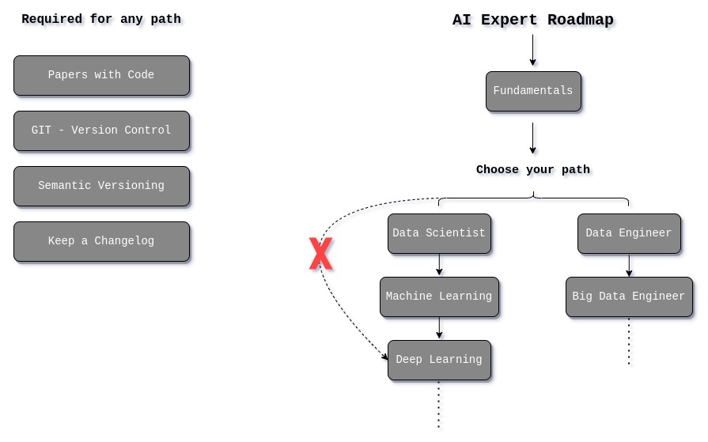
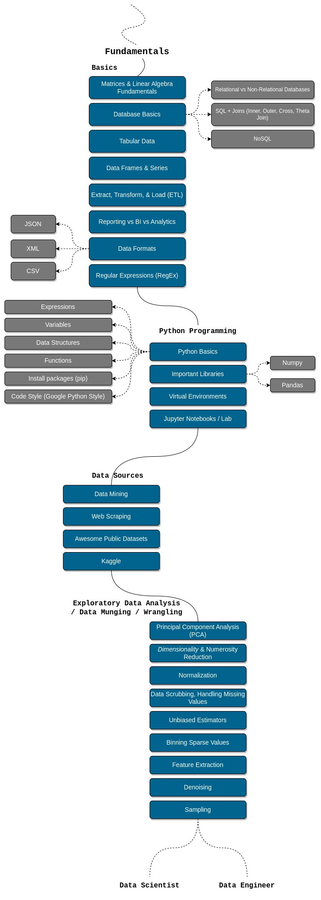
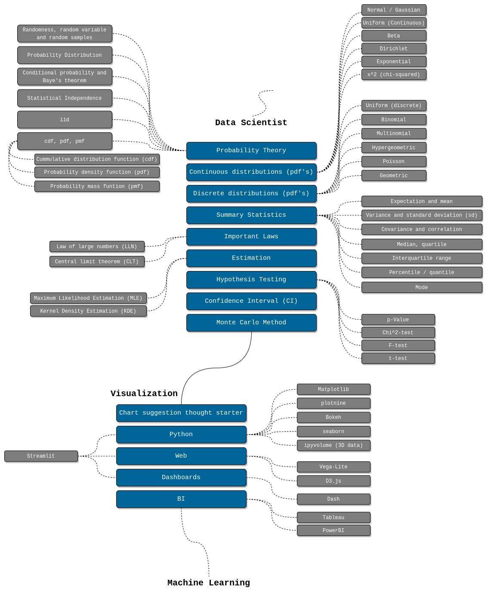
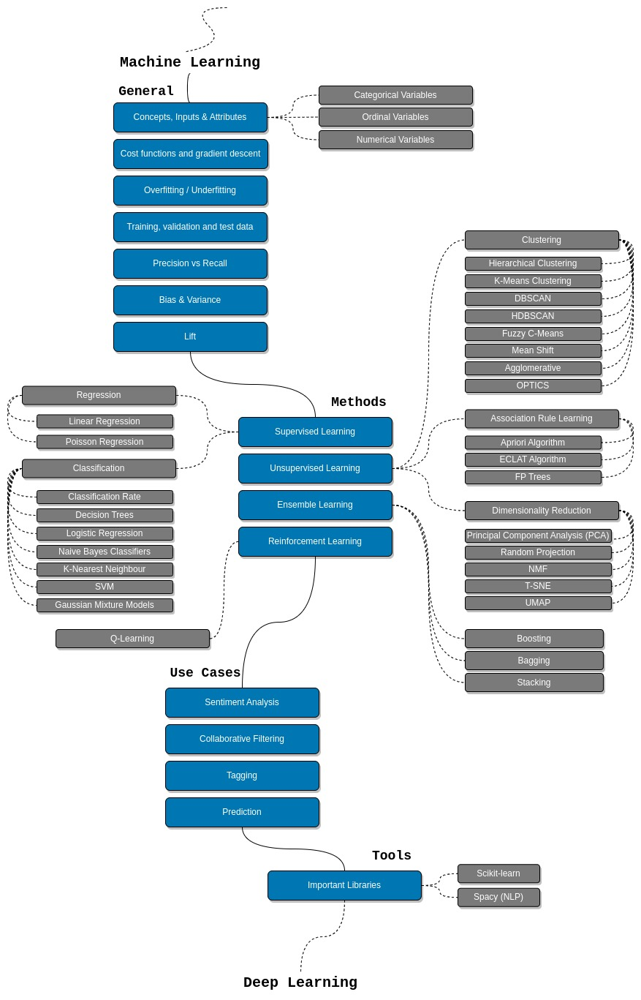
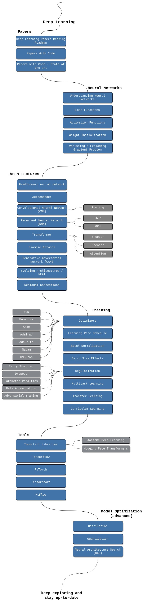

# AI

These are the source files for a light weight implementation of machine learning algorithms.

The idea is to learn machine learning by implementing the algorithms from ground up, harnessing the capabilities of plain numpy. This initiative goes beyond utilizing existing tools; it is a meticulous crafting of custom implementations that dive deep into the intricate mathematics underpinning each algorithm.

To contribute to AI, please read the [style guide](https://www.tensorflow.org/community/contribute/docs_style).

To jump onto the **Artificial Intelligence** roadmap, please click on the
[Artificial Intelligence Map](https://github.com/joshiayush/ai/tree/master/docs/roadmap.md).

###### ⚠️ This project contains documents that are written on top of [Machine Learning Foundational Course by Google](https://developers.google.com/machine-learning/crash-course/ml-intro), which is free ofcourse, in the beginning the documents were identical to the articles you'll find in the *Machine Learning Foundational Course by Google*; I don't own those documents neither I happen to do anything with Google nor do I intend to change the contents license 🙏.

## Contents

1. [Resources](https://github.com/joshiayush/ai/tree/master/docs/resource#resources) (Resources required during learning)
2. [Prework](https://github.com/joshiayush/ai/blob/master/docs/prework#prework) (A bit of prework required before starting machine learning)
3. [Machine Learning](https://github.com/joshiayush/ai/tree/master/docs/ml#machine-learning) (A deep dive into the concepts of machine learning)
4. [Algorithms](https://github.com/joshiayush/ai/tree/master/docs/algos#algorithms) (Implementation of common machine learning algorithms)
5. [Roadmap](https://github.com/joshiayush/ai#roadmap) (Artificial Intelligence Engineer Roadmap)

## API Usage

Using the `LinearRegression` estimator:

```python
import numpy as np

from sklearn import datasets
from sklearn.metrics import accuracy_score
from sklearn.model_selection import train_test_split

from ai.linear_model import LinearRegression

X, y = datasets.make_regression(n_samples=100, n_features=1, noise=20, random_state=4)
X_train, X_test, y_train, y_test = train_test_split(
    X, y, test_size=0.2, random_state=42
)

model = LinearRegression()
model.fit(X_train, y_train)

y_pred = model.predict(X_test)

print(accuracy_score(y_pred, y_test))
```

## Roadmap

<div align='center'>
  
</div>

### Fundamentals

<div align='center'>
  
</div>

### Data Scientist

<div align='center'>
  
</div>

### Machine Learning

<div align='center'>
  
</div>

### Deep Learning

<div align='center'>
  
</div>
