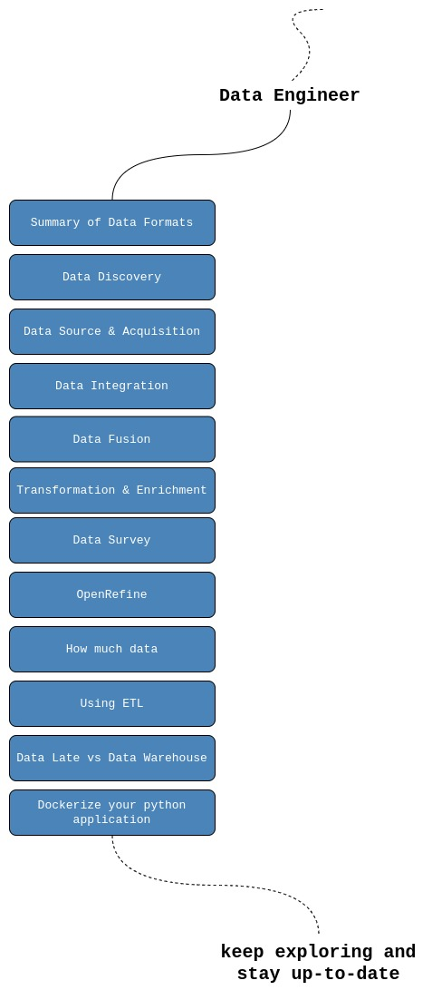
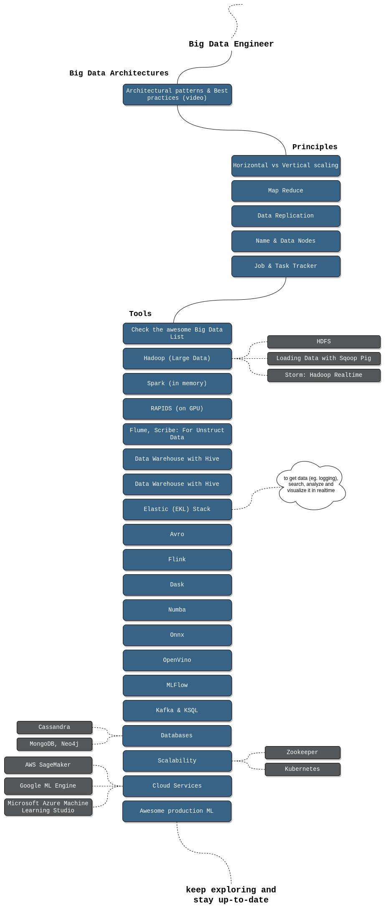

# Artificial Intelligence Guide

These are the source files for the guide on Artificial Intelligence.

To contribute to the Artificial Intelligence Guide, please read the
[style guide](https://www.tensorflow.org/community/contribute/docs_style).

# Roadmap

  

# Fundamentals

  

# Data Scientist

  

# Machine Learning

  

# Deep Learning

  

# Data Engineer

  

# Big Data Engineer

  

# Wrap Up

All the resources are aligned according to the roadmap inside of the [resource](ai/resource/) section of the root [ai](ai/) directory.

<!-- TODO: Auto-generate the following index when documents are generated! -->

1. [Resources](https://github.com/joshiayush/ai/tree/master/docs/resource)
    1. [Required](https://github.com/joshiayush/ai/tree/master/docs/resource/required)
        1. [Papers With Code](https://github.com/joshiayush/ai/blob/master/docs/resource/required/Papers-With-Code.md)
2. [Prework](https://github.com/joshiayush/ai/tree/master/docs/prework)
    1. [Introduction to Machine Learning Problem Framing](https://github.com/joshiayush/ai/blob/master/docs/prework/Introduction-to-Machine-Learning-Problem-Framing.md)
    2. [Framing an ML Problem](https://github.com/joshiayush/ai/blob/master/docs/prework/Framing-an-ML-problem.md)
    3. [NumPy](https://github.com/joshiayush/ai/blob/master/docs/prework/NumPy.md)
    4. [Pandas DataFrame](https://github.com/joshiayush/ai/blob/master/docs/prework/Pandas-DataFrame.md) 
3. [Tools](https://github.com/joshiayush/ai/tree/master/docs/tools)
    1. [NumPy](https://github.com/joshiayush/ai/tree/master/docs/tools/numpy)
        1. [NumPy (Numerical Python)](https://github.com/joshiayush/ai/blob/master/docs/tools/numpy/NumPy-(Numerical-Python).md)
    2. [Tensorflow](https://github.com/joshiayush/ai/tree/master/docs/tools/tensorflow)
        1. [Image Classification](https://github.com/joshiayush/ai/blob/master/docs/tools/tensorflow/Image-classification.md)
        2. [Classify Images of Clothing](https://github.com/joshiayush/ai/blob/master/docs/tools/tensorflow/Classify-images-of-clothing.md)
4. [Machine Learning](https://github.com/joshiayush/ai/tree/master/docs/ml)
    1. [Introduction to ML](https://github.com/joshiayush/ai/blob/master/docs/ml/Introduction-to-ML.md)
    2. [Descending into ML](https://github.com/joshiayush/ai/blob/master/docs/ml/Descending-into-ML.md)
    3. [Reducing Loss](https://github.com/joshiayush/ai/blob/master/docs/ml/Reducing-Loss.md)
    4. [Introduction to Tensorflow](https://github.com/joshiayush/ai/blob/master/docs/ml/Introduction-to-TensorFlow.md)
    5. [Generalization](https://github.com/joshiayush/ai/blob/master/docs/ml/Generalization.md)
    6. [Training and Test Sets](https://github.com/joshiayush/ai/blob/master/docs/ml/Training-and-Test-Sets.md)
    7. [Validation Set](https://github.com/joshiayush/ai/blob/master/docs/ml/Validation-Set.md)
    8. [Representation](https://github.com/joshiayush/ai/blob/master/docs/ml/Representation.md)
    9. [Feature Crosses](https://github.com/joshiayush/ai/blob/master/docs/ml/Feature-Crosses.md)
    10. [Regularization for Simplicity](https://github.com/joshiayush/ai/blob/master/docs/ml/Regularization-for-Simplicity.md)
    11. [Logistic Regression](https://github.com/joshiayush/ai/blob/master/docs/ml/Logistic-Regression.md)
    12. [Classification](https://github.com/joshiayush/ai/blob/master/docs/ml/Classification.md)
    13. Regularization for Sparsity
    14. Neural Networks
    15. Training Neural Nets
    16. Multi-Class Neural Nets
    17. Embeddings
5. [Algorithms](https://github.com/joshiayush/ai/tree/master/docs/algos)
    1. [Correlation](https://github.com/joshiayush/ai/tree/master/docs/algos/correlation)
        1. [Pearson Correlation Coefficient](https://github.com/joshiayush/ai/blob/master/docs/algos/correlation/pearson_correlation/Pearson-correlation-coefficient.md)